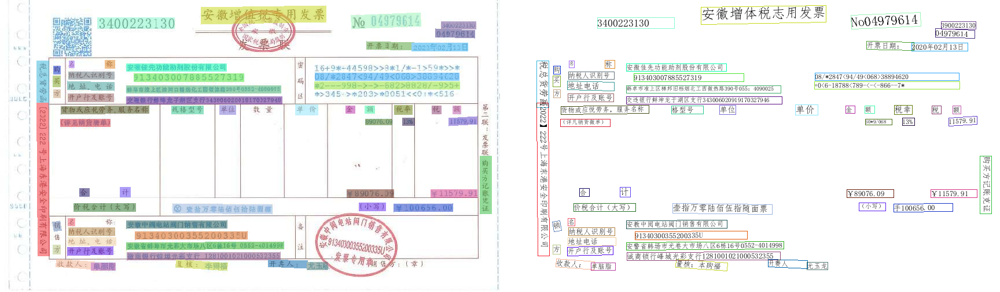
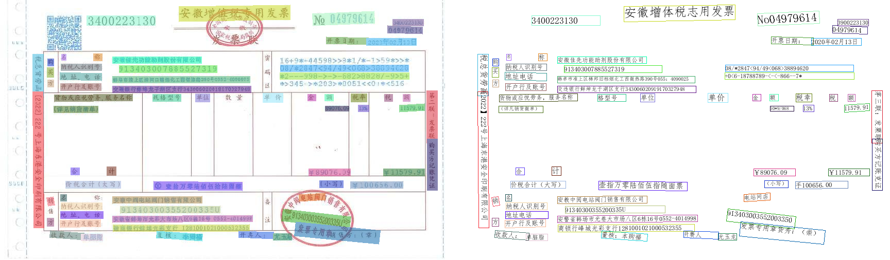

# OCR研究记录
## 参数设置
所有可修改预测参数在utility.py中的init_args中,在pip库paddleocr中未找到方便入口，可以在paddleocr.py中，手动
修改params.{参数}={value}

### use_dilation=True代表是否使用膨胀操作效果对比如下，上为默认，下为use_dilation=True


### det_db_box_thresh 代表检测框的阈值，只有置信度大于阈值的检测框才会被保留，效果对比如下，上为0.6，下为0.1



### 使用`--use_dilation=True`和`det_db_box_thresh=0.1`的效果如下


值得注意的是，使用pip库paddlocr 或paddleocr repo 中predict_system.py预测结果图中文字是否被检测出来不完全取决于det部分，在post_process方法中如果后续rec部分文字检测的置信度低于drop_score参数，那么图像中该位置的文字框会被舍弃掉。

### 如果想要直观的看到文字检测的效果，需要使用rec=False参数，这样就不会进行文字识别，而是直接将文字框画在图像上，效果如下


### det_db_thresh代表检测模型中DB算法二值化的阈值，具体效果为测试，但是预计修改后的会导致精读下降，建议不修改

### det_limit_side_len代表图像进入模型前压缩到多少像素，增大可显著提高分辨率图像的预测结果，但是会导致预测速度降低
## 优化方法
### 方向纠正
1.使用opencv 霍夫变化矫正

2.使用模型预测倾斜角度
### 文字检测
预计需要数据集1k张左右，标注所有预测框
### 文字识别
预计需要数据集中有50k左右个预测框，标注框所有文字
## 图像超分研究记录
 todo

# KIE研究记录
## 修改metrics：

在anaconda3\envs\paddle\Lib\site-packages\seqeval\metrics\sequence_labeling.py :line 116
中可以看到，默认计算p，r，f1时按首字母排序target_names = sorted(set(entities_true.keys()) | set(entities_pred.keys()))

目前修改ppocr\metrics\vqa_token_ser_metric.py line 69 中get_metric(self)方法
 ```python
class VQASerTokenMetric(object):
    def __init__(self, main_indicator='hmean', **kwargs):
        self.main_indicator = main_indicator
        self.reset()
        self.important_code = [
                                'title',
                                'no_value',
                                'code_value',
                                'date_value',
                                'check_code_value',
                                'machine_code_value',
                                'name_value',
                                'uscc_value',
                                'address_value',
                                'bank_value',
                                'password_value',
                                'item_value',
                                'commodity_type_value',
                                'unit_value',
                                'num_value',
                                'price_value',
                                'amount_value',
                                'tax_rate_value',
                                'tax_amount_value',
                                'total_tax_value',
                                'total_amount_value',
                                'lower_amount_value',
                                'upper_amount_value',
                                'seller_name_value',
                                'seller_uscc_value',
                                'seller_addr_value',
                                'seller_bank_value',
                                'payee_value',
                                'checker_value',
                                'drawer_value',
                                'remark_value'
                                ]
        self.very_important_code = ['seller_name_value','name_value','date_value']

    def __call__(self, preds, batch, **kwargs):
        preds, labels = preds
        self.pred_list.extend(preds)
        self.gt_list.extend(labels)

    def get_metric(self):
        from seqeval.metrics import f1_score, precision_score, recall_score
        metrics = {}
        names = sorted(set(self.important_code))
        p = precision_score(self.gt_list, self.pred_list, average=None)
        r = recall_score(self.gt_list, self.pred_list, average=None)
        f1 = f1_score(self.gt_list, self.pred_list, average=None)
        metrics['avr_f1'] = np.mean(f1)
        metrics['avr_p'] = np.mean(p)
        metrics['avr_r'] = np.mean(r)
        vip_p = []
        vip_r = []
        vip_f1 = []
        for i in range(len(self.very_important_code)):
            vip_p.append(p[names.index(self.very_important_code[i])])
            vip_r.append(r[names.index(self.very_important_code[i])])
            vip_f1.append(f1[names.index(self.very_important_code[i])])
        metrics['vip_avr_f1'] = np.mean(vip_f1)
        metrics['vip_avr_p'] = np.mean(vip_p)
        metrics['vip_avr_r'] = np.mean(vip_r)

        for i in range(len(names)):
            metrics[f'{names[i]}_f1'] = f1[i]
            metrics[f'{names[i]}_p'] = p[i]
            metrics[f'{names[i]}_r'] = r[i]

        self.reset()
        return metrics

    def reset(self):
        self.pred_list = []
        self.gt_list = []
 ```

# UIE研究记录

## UIE流程
### max_seq_len参数
Taskflow("information_extraction", schema=[""], model="uie-x-base", layout_analysis=True,
                   max_seq_len=1024)
max_seq_len在paddlenlp\taskflow\information_extraction.py： line 665中可以看到max_predict_len = self._max_seq_len - len(max(prompts)) - self._summary_token_num，超过max_predict_len的文本会被分割成多份，影响max_predict_len的一个是self._max_seq_len参数，一个是最大prompts长度，一个是self._summary_token_num，self._summary_token_num在uie-x中为4.

输入有6个，其内容为：
1：所有token input_ids
2：token_type_ids
3：token序号 pos_ids
4：有效标记 att_mask
5：token对应框 bbox
6：原图resize到224，224 image
输出为
7：标签 offset_maps

### position_prob参数
在PaddleNLP\paddlenlp\taskflow\information_extraction.py ：line1009中看到模型直接输出是一个start_prob：list和end_prob:list,取两个list中大于position_prob的点作为开始和结束点在所有token中截取输出文本。
## 训练结果可视化
在训练过程中，可以使用visualdl工具查看训练过程中的loss,f1变化情况，具体操作如下:
在命令行中输入`visualdl --logdir {logdir}` ,logdir中可方加入多个log文件，然后在浏览器中输入`http://localhost:8040/` 即可查看训练过程中的loss,f1变化情况

## eval
在 PaddleNLP\paddlenlp\utils\ie_utils.py line：131 compute_metrics方法中修改metric可以生效，其中start_prob, end_prob同[上](#position_prob参数)所述
# 图像分类研究记录
## 纯图像分类方案
## UIE-base 图像加ocr结果分类方案

## 拉数据
root@192.168.3.210

root@192.168.3.210:/home/dataset/data-1/
## 模型结构
### 1.简单方案
使用纯卷积网络构建resnet主干的分类网络，使用全局池化代替全连接层，使用softmax代替sigmoid，使用交叉熵代替focal loss
### 2.复杂方案
~~在简单方案的基础上，加入图像ocr检测框作为辅助信息，做多模态学习~~

https://github.com/PaddlePaddle/PaddleNLP/blob/develop/model_zoo/ernie-lyout/README.zh.md
使用ocr全部结果和原始image作为辅助信息，做多模态学习,模型输入与UIE-X相同，但是模型结构不同，使用ernie-lyout模型，使用paddlepaddle框架


#### 修改自定义数据集

[demo.py](asset/demo.py)
参照
#### paddlepaddle版本可能出现的问题
部分api名字随着版本的更新而改变，已知可能出现的问题如下：
paddlenlp/trainer/trainer.py line:1187，删除整个 if paddle.device.get_all_custom_device_type() is not None:下内容
paddlenlp/trainer/trainer.py line:1690，paddle.get_rng_state() ->paddle.get_cuda_rng_state()
#### 修改metrics
paddlenlp/trainer/layout_trainer.py line:66中修改metrics没有用，会在返回的时候丢弃所有self.metrics的内容.
因此需要直接修改metrics，metrics变量为字典类型，可以自定义metrics计算方法。

 ```python
label_dict = {
    "invoice": 0,
    "contract": 1,
    "bank_receipt": 2,
    "central_unified": 3,
    "image_progress": 4,
    "quantities_valuation": 5,
    "statement_accounting_balance": 6,
    "business_license": 7,
    "commercial_housing_sales_ledger": 8,
    "total_output_value_construction_schedule": 9,
    "project_approval_documents": 10,
    "document_filing": 11,
    "site_construction_photos": 12,
    "equipment_in_place_photo": 13,
    "project_site_verification_form": 14,
    "organization_code_certificate": 15,
    "public_institution_legal_person_certificate": 16,
    "construction_permit_for_construction_project": 17,
    "state_owned_land_use_right_certificate": 18,
    "construction_land_use_permit": 19,
    "other": 20,
}
 ```
#### 第一次实验：
直接使用原始数据，各个类别的数据量如下：


检测结果如下：
[metrics_1.txt](asset%2Fmetrics_1.txt)

#### 第二次实验：
策略调整，将数据量较多的类别的数据量减少到300，同时增加了更多指标，各个类别的metrics如下：

[metrics_2.txt](asset/metrics_2.txt)

发现other类无法分类，准备进行第三次实验删除other类

#### 第三次实验：

[metrics_3.txt](asset/metrics_3.txt)


# 智慧文档（IE）记录

##使Taskflow("document_intelligence")返回文本对应box值

paddlenlp\taskflow\document_intelligence.py 中line:178开始加入：
```
                        bboxes = []
                        for pred in preds:
                            start = pred["start"]
                            end = pred["end"]
                            boxes = example.ori_boxes[start:end + 1]
                            # combine boxes
                            if len(boxes) > 1:
                                box_x1 = min([boxes[i][0].left for i in range(len(boxes))])
                                box_y1 = min([boxes[i][0].top for i in range(len(boxes))])
                                box_x2 = max([boxes[i][0].right for i in range(len(boxes))])
                                box_y2 = max([boxes[i][0].bottom for i in range(len(boxes))])
                            bboxes.append([box_x1, box_y1, box_x2, box_y2])

                    all_predictions.append({"prompt": example_query, "result": preds,"bbox":bboxes})
```
