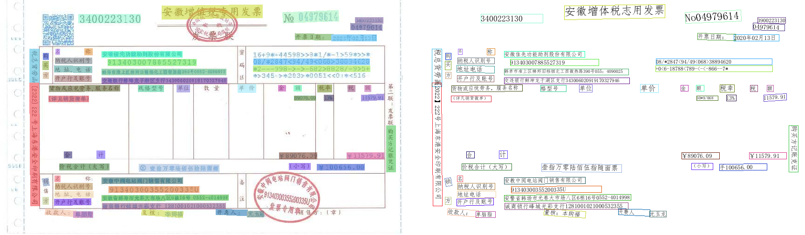
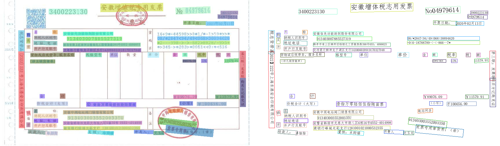

# OCR研究记录
## 参数设置
所有可修改预测参数在utility.py中的init_args中,在pip库paddleocr中未找到方便入口，可以在paddleocr.py中，手动
修改params.{参数}={value}

### use_dilation=True代表是否使用膨胀操作效果对比如下，上为默认，下为use_dilation=True

### det_db_box_thresh 代表检测框的阈值，只有置信度大于阈值的检测框才会被保留，效果对比如下，上为0.6，下为0.1

### 使用`--use_dilation=True`和`det_db_box_thresh=0.1`的效果如下

值得注意的是，使用pip库paddlocr 或paddleocr repo 中predict_system.py预测结果图中文字是否被检测出来不完全取决于det部分，在post_process方法中如果后续rec部分文字检测的置信度低于drop_score参数，那么图像中该位置的文字框会被舍弃掉。

### 如果想要直观的看到文字检测的效果，需要使用rec=False参数，这样就不会进行文字识别，而是直接将文字框画在图像上，效果如下

### det_db_thresh代表检测模型中DB算法二值化的阈值，具体效果为测试，但是预计修改后的会导致精读下降，建议不修改

### det_limit_side_len代表图像进入模型前压缩到多少像素，增大可显著提高分辨率图像的预测结果，但是会导致预测速度降低
## 优化方法
### 方向纠正
1.使用opencv 霍夫变化矫正

2.使用模型预测倾斜角度
### 文字检测
预计需要数据集1k张左右，标注所有预测框
### 文字识别
预计需要数据集中有50k左右个预测框，标注框所有文字
## 图像超分研究记录
 todo
# UIE研究记录

## UIE流程

## 训练结果可视化
在训练过程中，可以使用visualdl工具查看训练过程中的loss,f1变化情况，具体操作如下:
在命令行中输入`visualdl --logdir {logdir}` ,logdir中可方加入多个log文件，然后在浏览器中输入`http://localhost:8040/` 即可查看训练过程中的loss,f1变化情况

# 图像分类研究记录
拟采用tensorflow自写模型 

## 拉数据
root@192.168.3.210

root@192.168.3.210:/home/dataset/data-1/
## 模型结构
### 1.简单方案
使用纯卷积网络构建resnet主干的分类网络，使用全局池化代替全连接层，使用softmax代替sigmoid，使用交叉熵代替focal loss
### 2.复杂方案
~~在简单方案的基础上，加入图像ocr检测框作为辅助信息，做多模态学习~~

https://github.com/PaddlePaddle/PaddleNLP/blob/develop/model_zoo/ernie-lyout/README.zh.md
使用ocr全部结果和原始image作为辅助信息，做多模态学习,模型输入与UIE-X相同，但是模型结构不同，使用ernie-lyout模型，使用paddlepaddle框架

#### 修改自定义数据集

[demo.py](demo.py)

#### 第一次实验：
直接使用原始数据，各个类别的数据量如下：

检测结果如下：
invoice: acc: 1.0
contract: acc: 0.9743589743589743
bank_receipt: acc: 1.0
central_unified: acc: 1.0
image_progress: acc: 0.7
quantities_valuation: acc: 0.6428571428571429
statement_accounting_balance: acc: 1.0
business_license: acc: 0.5
commercial_housing_sales_ledger: acc: 1.0
total_output_value_construction_schedule: acc: 1.0
project_approval_documents: acc: 0.4
document_filing: acc: 0.0
site_construction_photos: acc: 0.9411764705882353
equipment_in_place_photo: acc: 0.375
project_site_verification_form: acc: 0.0
organization_code_certificate: acc: 0.5
public_institution_legal_person_certificate: acc: 0.0
state_owned_land_use_right_certificate: acc: 1.0
construction_land_use_permit: acc: 1.0
other: acc: 0.9365079365079365
average acc: 0.95

#### 第二次实验：
策略调整，将数据量较多的类别的数据量减少到300，各个类别的数据量如下：

